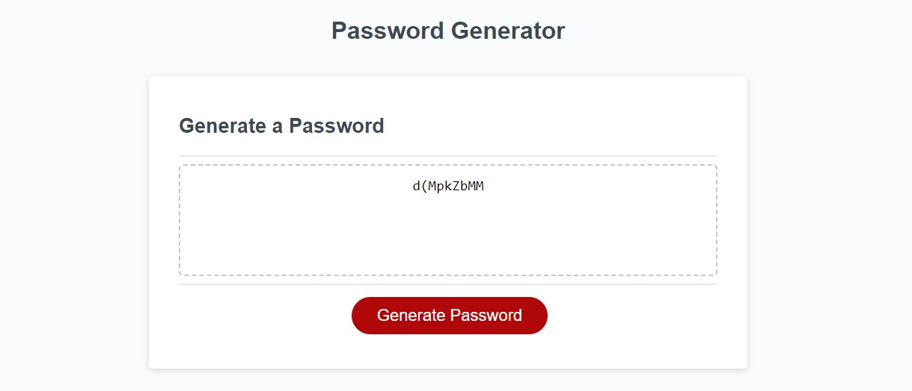

# JavaScript Password Generator

* Challenge week 3- We were given starter code this week to finish building a password generator with confirmation. 
We had to include the variables of uppercase letters, numbers, and special characters so that the user could pick what they wanted in their password. 
This was brutal for me, I understand the idea and what we are trying to accomplish its putting the pieces together that have been the hard part. Mostly renaming variables to be
equal to a new one. 

# "Sometimes you run into very strange errors that are difficult to solve and that's a part of programming sometimes. Sucks to have to deal with it" Andrew Hardemon

# Technologies Used
    HTML
    CSS
    JavaScript

# In this code you will find a password generator that has prompt box and confirmation checks 
 * We leared a lot this week and this goes to show the capabilities of .js.
 * commented what I wanted to do with my code as I peiced together the code

# Setup/Installation Requirements
    Clone this repository to your desktop
    Navigate to the top level of the directory
    open index.html

# Credits
 * W3 Schools for some .js methods and functions
 * W3 Schools for README.MD Directions
 * My tutor!

https://github.com/Catalystix/Password-Generator-3.3

https://catalystix.github.io/Password-Generator-3.3/